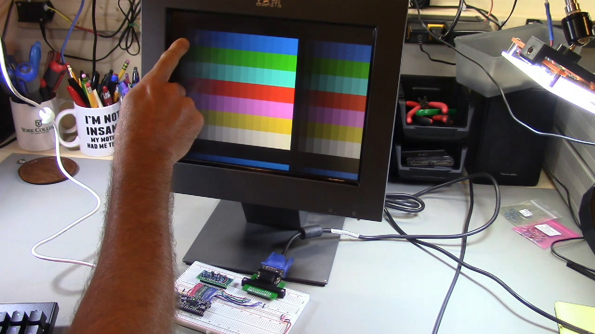

# DIY 8-bit computer, Episode 15

Link to video: <https://youtu.be/5xY3-Er72VU>

In this video, I evaluate possibilities for adding a display to the 8-bit
computer, and perform some initial experiments to generate an 800x600 SVGA
signal using an FPGA.

The FPGA board I am using is the [Upduino 3.0](https://tinyvision.ai/products/upduino-v3-0),
which uses the [Lattice UltraPlus ICE40UP5K](https://www.latticesemi.com/en/Products/FPGAandCPLD/iCE40UltraPlus)
FPGA.  One great advantage of this FPGA family is that it can be programmed using
the Open Source [IceStorm](http://www.clifford.at/icestorm/) toolchain.
I am using [apio](https://github.com/FPGAwars/apio) as a front-end for the
FPGA tools.

I wrote a blog post describing how to set up a development environment for
the Upduino 3.0: <https://daveho.github.io/2021/02/07/upduino3-getting-started-on-linux.html>

The schematic for the test circuit is in the [HardwareDesign](HardwareDesign)
directory, in the sheet called `Display`.  There is a PDF of the schematic,
[F68.pdf](HardwareDesign/F68.pdf).  (The overall system is going to be called
"F68", I will talk about this in a future video.)

The following directories have code for the various FPGA experiments:

* [Experiment01](Experiment01): generate a 6 MHz square wave using the
  internal high-frequency oscillator
* [Experiment02](Experiment02): generate a 1.875 MHz square wave using
  the internal high-freqency oscillator and a PLL
* [Experiment03](Experiment03): generate a 6 MHz square wave using the
  on-board 12 MHz oscillator (the internal high-frequency oscillator is
  not very accurate)
* [Experiment04](Experiment04): generate a 1.875 MHz square wave using
  the 12 MHz oscillator and a global clock buffer
* [Experiment05](Experiment05): generate 800x600 60 video displaying
  a solid color
* [Experiment06](Experiment06): generate a 800x600 test pattern showing
  color gradients, in order to evaluate the 4 bit resistor DACs used for
  converting the digital outputs to analog color voltages
  (this is what you see in the photo above)

Other directories:

* [DAC](DAC): has a [Qucs](http://qucs.sourceforge.net/) simulation of the
  resistor DAC design, and a [Gnumeric](http://www.gnumeric.org/) spreadsheet
  showing the voltages generated by a test circuit for each digital input
  value
* [Mechanical](Mechanical): has a 3D-printable bracket that attaches to the
  VGA breakout board I'm using in order to give it some additional support
  on the breadboard (to avoid putting unnecessary stress on the header pins)
