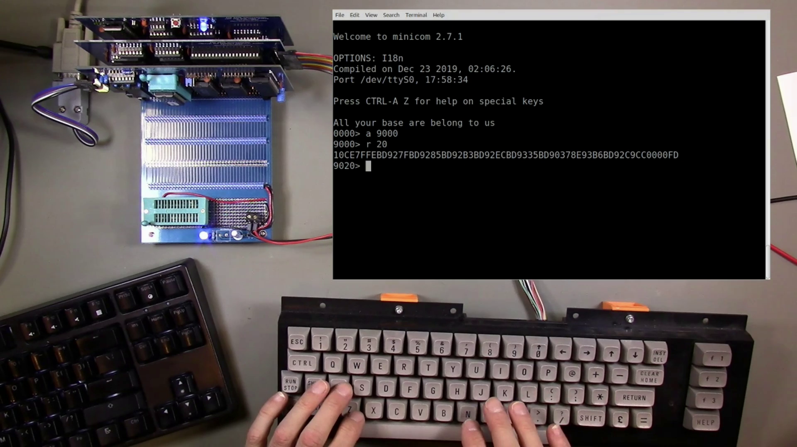

# DIY 8-bit computer, Episode 19

Link to video: <https://youtu.be/RM4j6294dPY>

In this video, I assemble and test a PCB implementing the interrupt
and keyboard controllers.  I also fix minor issues with the handling
of end of line inputs and cursor movement in the ROM monitor program,
and assemble a new backplane.

The [Code](Code) directory has the updated ROM monitor code.
