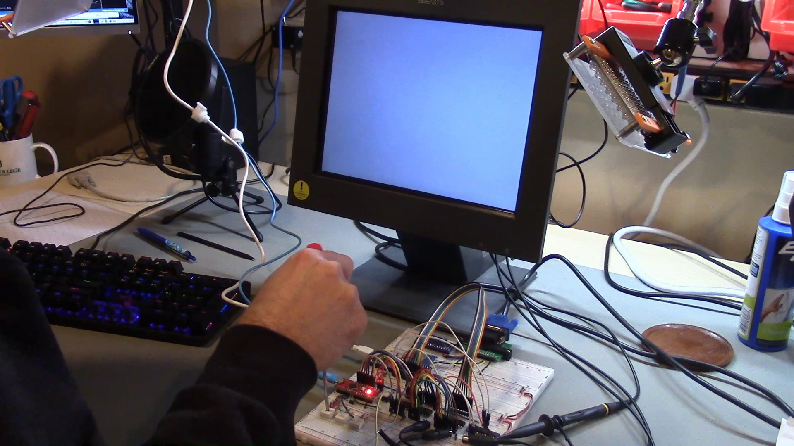

# DIY 8-bit computer, Episode 1A

Link to video: <https://youtu.be/MTqwGI0u0LY>

In this video, I develop a host interface for the FPGA-based
display controller I started in [Episode 15](../Episode15).
You should probably watch that episode first!

The [HardwareDesign](HardwareDesign) directory has the hardware
design (tested and verified working in this Episode.)
The schematics are (of course) developed using [KiCad](https://www.kicad.org/).

In the video, I mention creating a better resistor DAC.
The resistor DAC PCB you can see in the video can be found
here: <https://github.com/daveho/BreadboardDAC>.
I had the PCBs fabbed by [OSHPark](https://oshpark.com/),
and as usual they did an excellent job.  You should be
able to upload [BreadboardDAC.kicad\_pcb](https://github.com/daveho/BreadboardDAC/raw/master/BreadboardDAC.kicad_pcb) to OSHPark directly (no need to generate gerbers.)

The [Experiment01](Experiment01) through [Experiment05](Experiment05)
directories contain the FPGA designs for the various experiments
shown in the video. The FPGA board is an [Upduino 3.0](https://tinyvision.ai/products/upduino-v3-0),
based on the [Lattice ICE40 UP5k](https://www.latticesemi.com/Products/FPGAandCPLD/iCE40UltraPlus)
FPGA. It is programmed using the amazing [IceStorm](http://bygone.clairexen.net/icestorm/)
toolchain developed by [Claire Wolf](https://www.clairexen.net/).
I use [APIO](https://github.com/FPGAwars/apio) to orchestrate the
tools.  You can check out a
[blog post](http://daveho.github.io/2021/02/07/upduino3-getting-started-on-linux.html)
I wrote explaining how to get started programming the Upduino 3.0.
Some of the experiments include an Arduino Nano serving as a
proxy for the host system, in which case you will find an
`ArduinoSketch` directory with the firmware code.

The [Experiment01](Experiment01) directory adds a reset input to
the display controller. This will ensure that the display controller
starts in a known state when the system comes out of reset.

The [Experiment02](Experiment02) directory configures the FPGA with
the inputs and outputs needed to interface with the FIFO used for
communication with the host system, but doesn't actually do anything
with them.

The [Experiment02a](Experiment02a) and [Experiment02b](Experiment02b)
directories are based on Experiment02, but change the PLL configuration
so that different internal clock frequencies are used.

The [Experiment03](Experiment03) directory has the FPGA reading commands
from the host system via the FIFO.

The [Experiment04](Experiment04) directory has the FPGA using the low
4 bits of received commands to control the blue color component of
all generated pixels. The Arduino sents increasing count values,
so we get a nicely annoying flashing effect.

The [Experiment05](Experiment05) directory has the Arduino sending
commands to control the individual red, green, and blue color components
based on values read from three potentiometers connected to analog
inputs 0, 1, and 2.
