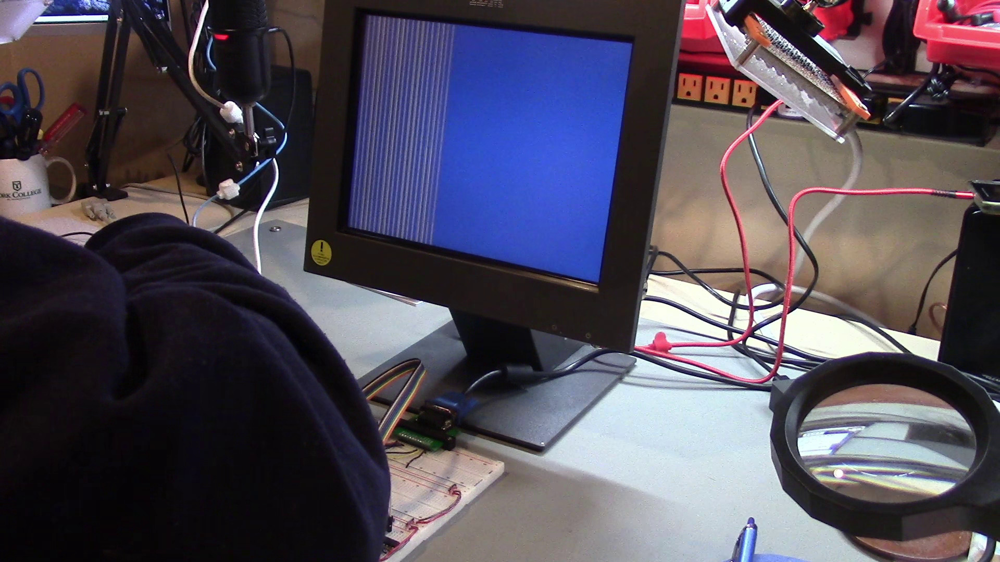

# DIY 8-bit computer, Episode 1B

Link to video: Coming soon!

In this video, I discuss an approach for making the display controller
design work.  (We started the display controller in
[Epsiode15](../Episode15) and continued it in [Episode1A](../Episode1a).)
We also incorporate a block RAM into the design.

The hardware design is the same as in the [previous episode](../Episode1a).

The [Experiment01](Experiment01) and [Experiment02](Experiment02) directories
were intermediate stages of a general cleanup and modularization of the
Verilog code for the display controller.

The [Experiment03](Experiment03) directory has the Verilog code which
places command bytes sent by the simulated host system into a block RAM,
which in turn is used to generate a pattern of foreground and background
pixels on each generated raster line.  Even though it's not too impressive
to look at, it proves that we can get data into the FPGA and use it to
render display output, which is a pretty significant step.
