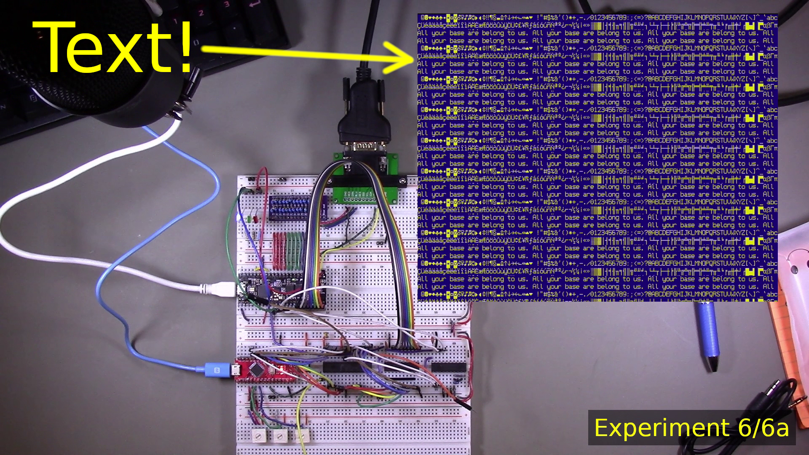

# Episode 1C

Link to video: *coming soon*

The goal of this episode is to have the display controller display
characters as 800x600 SVGA video, with the Arduino (standing in for
the host system) uploading font and character data to the
display controller's block RAM.

Spoiler: it worked.

The experiment directories (linked below) have the Verilog and Arduino
code.  The hardware design the same as [Episode 1A](../Episode1a).

## Summary of experiments

[Experiment 1](Experiment01): Change core FPGA clock frequency to 39.75 MHz because
an update to the IceStorm tools caused the design to not synthesize
correctly at 80 MHz.  This is ok, since pipelining should completely
obviate the need for a fast clock.

[Experiment 2](Experiment02): Generate 8 pixels at a time from a single 8 bit register.
The idea is that this is the last stage in the video output.
(Eventually we'll need to add support for foreground/background
colors, but they can just be stored in a different register.)

[Experiment 3](Experiment03): Begin to implement a command protocol. The basic format
is a single command byte followed by 1 or more additional data bytes.
This required quite a bit of time to get working because the
`shared_reg` module had a bug where the consumer would see a data
byte twice due to the way the data available flag was updated.
Was able to figure this out using the oscilloscope: it was clear
that the same data byte was being consumed twice.

[Experiment 4](Experiment04): Have the host upload 8x16 VGA font data to block RAM.

[Experiment 5](Experiment05): Have the host upload character data to block RAM, and
attempt to render it as characters. This *sort of* works. Definitely
some recognizable characters are displayed, but they're not quite in
the expected places on the screen.

[Experiment 6](Experiment06): try to get all of the characters to display at precisely
the correct locations.

Experiment 6a: this was done to support Experiment 6. It became clear
that the hsync and vsync generation and hcount/vcount generation was
not placing pixels in the correct locations. In this experiment, the
output was a grid with horizontal and vertical lines every 16 pixels.
By adjusting hsync and vcount (as exposed to the main module), we were
able to make hcount==0 the exact left row, and vcount==0 the exact
top row. (I think! It still seems like only 799 columns are being
displayed.)
