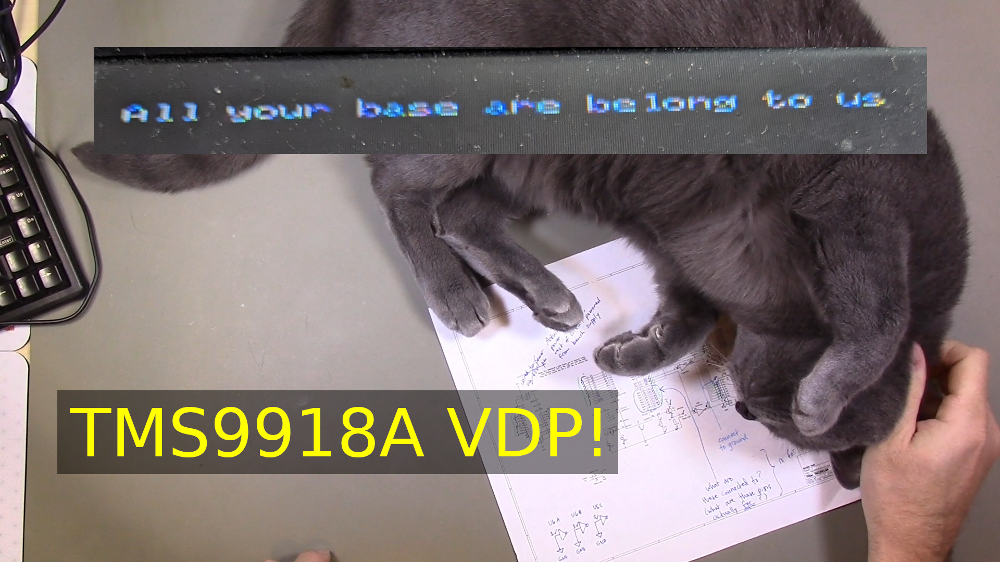

# Episode 1D

Link to video: <https://youtu.be/MCGEp9laRh4>

The goal of this episode is to experiment with a
[TMS9918A Video Display Processor](https://en.wikipedia.org/wiki/TMS9918)
and to attempt to use it as a display for the 6809 8-bit computer system.

With the TMS9918A providing a display, we're one step closer to the
6809 system being a fully independent computer.

An updated hardware design, including the schematic for the TMS9918A 
module, is in the [HardwareDesign](HardwareDesign) directory.

The updated monitor program, which initializes the TMS9918A and
displays a message, is in the [Code](Code) directory.

The demo circuit shown in the video, which I will be using as the
basis for the TMS9918A module, was created by Dr. Volt:

* Dr. Volt's TMS9918A project on Github: <https://github.com/michalin/TMS9918_Arduino>
* Dr. Volt's youtube channel: <https://www.youtube.com/@DoctorVolt>

I was inspired to try the TMS9918A based on a suggestion from
Troy Schrapel:

* Troy's 6502 system (which uses the TMS9918A): <https://visrealm.github.io/hbc-56/>
* Troy's youtube channel: <https://www.youtube.com/@TroySchrapel>
