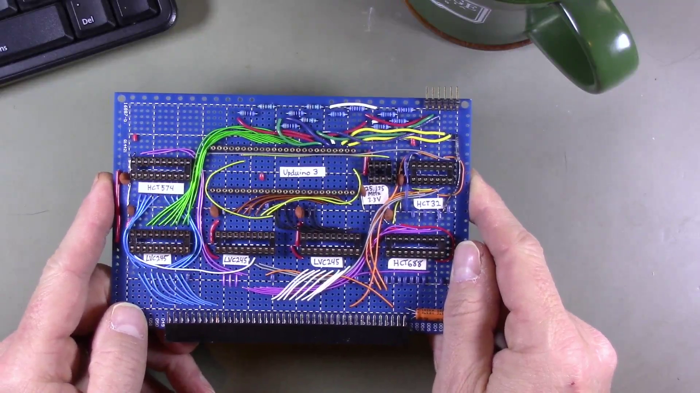
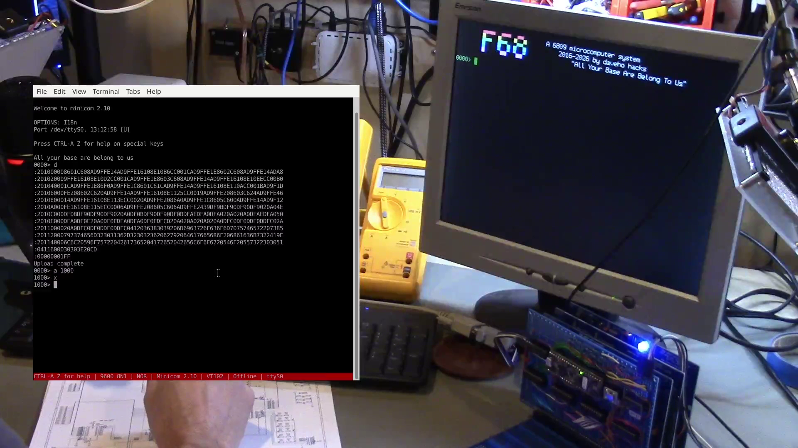

# Episode 1E

In this episode, I implement my
[FPGA VGA text display](https://github.com/daveho/FPGA_VGA)
as a module for the 6809 system.

Link to video: coming soon!

The module (implemented using point to point wiring on
a protoboard):

Picture of it working:

The schematic is the "FPGADisplayController" sheet of
[the main schematic](../HardwareDesign).

The Verilog files are in the [FPGADisplayController](../FPGADisplayController)
directory.
