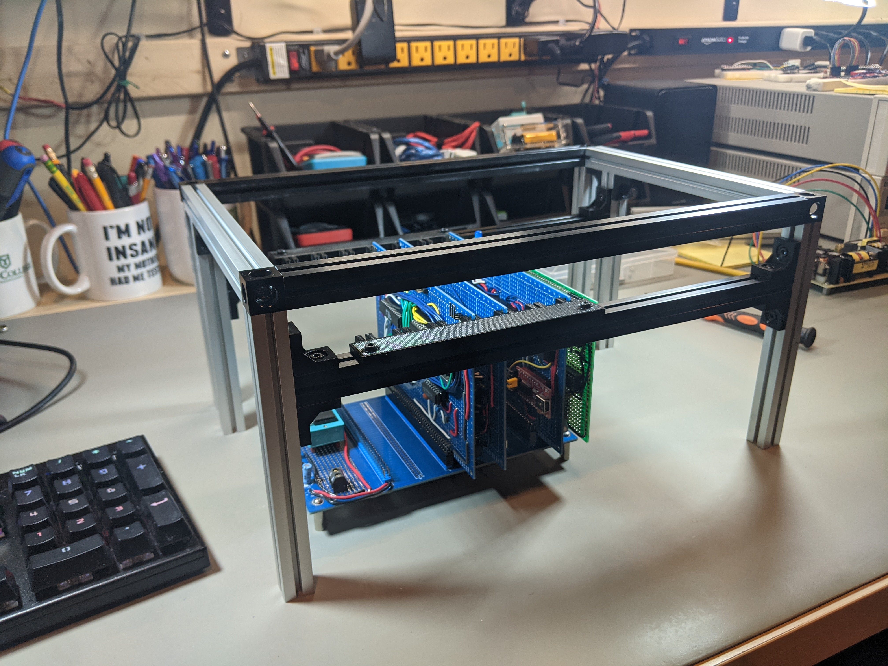
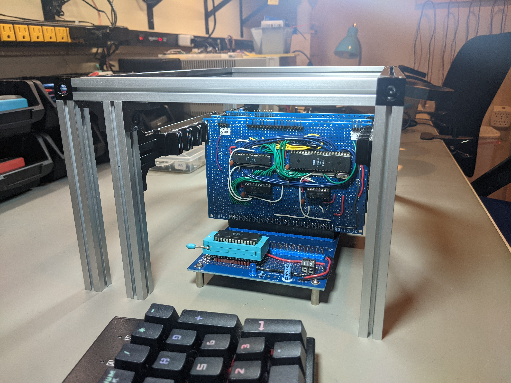

# Mechanical designs and files

This directory contains information about the enclosure for the 8-bit computer
system.

## Frame

The frame for the enclosure is built using 15x15mm aluminum extrusions, specifically
[MakerBeam XL](https://www.makerbeam.com/makerbeamxl/).  [OpenBeam](https://www.makerbeam.com/openbeam/)
is the same profile, but does not have threaded holes at the ends of the beam (which is needed
to use the corner connectors.)

Pictures of the frame:

Two 3D printed parts are used.

* [lbracket.stl](lbracket.stl): OpenBeam corner brace, from <https://www.thingiverse.com/thing:29794>, design by [brucethehoon](https://www.thingiverse.com/brucethehoon), [CC-BY-SA 3.0](https://creativecommons.org/licenses/by-sa/3.0/)
* [CardGuide.stl](CardGuide.stl)/[CardGuide.scad](CardGuide.scad): card guide, designed by [me](https://github.com/daveho), [CC-BY-SA 3.0](https://creativecommons.org/licenses/by-sa/3.0/)

Parts list for frame:

Quantity | Description/link
-------- | ----------------
6        | [150mm MakerBeam XL](https://www.amazon.com/MakerBeam-XL-anodized-150x15x15mm-103150/dp/B06XJ4FV75)
2        | [200mm MakerBeam XL](https://www.amazon.com/MakerBeam-XL-Anodized-200x15x15mm-Pieces/dp/B06XHQH9WH)
4        | [300mm MakerBeam XL](https://www.amazon.com/MakerBeam-300mm-beam-black-anodised/dp/B00G2DNU4M)
40       | [6mm M3 bolt](https://www.amazon.com/gp/product/B07CMRQ3TB)
40       | [Square 5x5x2 mm M3 nut](https://www.amazon.com/gp/product/B089Q6C4CM)
12       | [3D printed OpenBeam corner brace](lbracket.stl)
2        | [Card Guide](CardGuide.stl)

Note that you can use the [MakerBeam XL T-Slot nuts](https://www.amazon.com/gp/product/B06XHQHD4H)
rather than the square M3 nuts, but they are very expensive.

<!--
3D printed parts:

* [Square\_Plate\_OpenBeam\_1515.STL](Square_Plate_OpenBeam_1515.STL): OpenBeam square plate 2x2, from <https://www.thingiverse.com/thing:63837>, design by [halley](https://www.thingiverse.com/halley), 
* [L\_Plate\_WO\_Gusset\_OpenBeam\_1515.STL](L_Plate_WO_Gusset_OpenBeam_1515.STL): OpenBeam L bracket, from <https://www.thingiverse.com/thing:1876296>, design by [evancli](https://www.thingiverse.com/evancli)
-->
